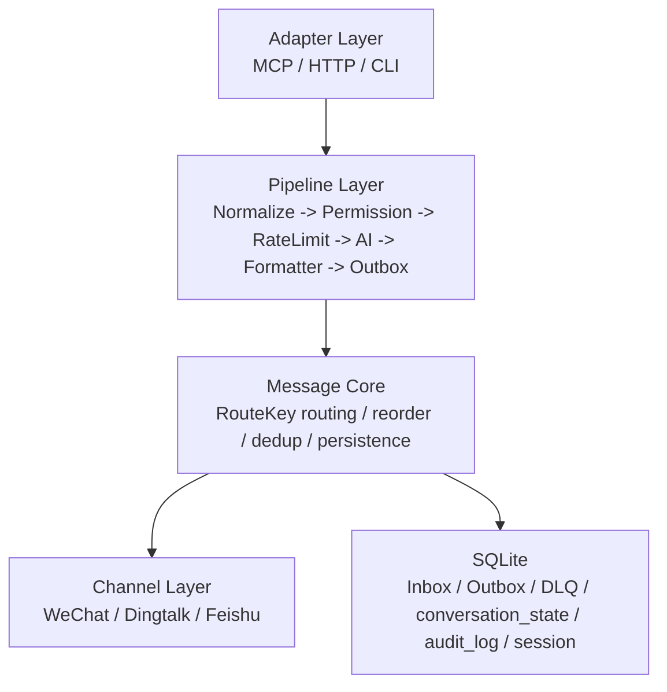

# aiclaw

信道中心架构系统。基于 Rust 的多平台消息中枢，优先保证信道稳定性、顺序正确性和可恢复投递；AI 只是可插拔能力，不是核心依赖。

## 1. 项目定位

- 目标：把 WeChat、Dingtalk、Feishu 等信道统一接入一个可恢复、可审计、可扩展的消息核心。
- 核心原则：同一会话串行、跨会话并行；Inbox/Outbox/DLQ 持久化；崩溃后可恢复；MCP/REST/CLI 只作为 Adapter，不侵入核心模型。
- 当前重点：WeChat 主链路、MCP stdio、可恢复投递、可插拔本地 CLI Agent。

## 2. 设计概览

### 2.1 分层架构



### 2.2 关键设计规则

- Core 不依赖 Agent；AI 后端故障时降级为 echo，主链路不中断。
- `RouteKey` 包含 `channel`、`conversation_id`、`peer_id`、`conversation_type`，Conversation 是一等对象。
- 同 `RouteKey` 串行，不同 `RouteKey` 并行；空闲 route worker 默认 30 分钟回收。
- Dedup 使用 TTL Cache(moka)，默认 TTL 5 分钟，容量 200 万。
- 乱序消息按平台能力处理：有 sequence 按 sequence；无 sequence 按 `timestamp + reorder_window_ms`。
- 发送状态机：`pending -> sending -> sent`，失败进入 `retrying`，超阈值进入 `dead_letter`。
- 关键数据流和 AI/发送决策写入 `audit_log`。
- 外部平台 API 与 AI API 都放在熔断 + 隔离舱后面，防止级联故障。

### 2.3 当前主链路

入站消息进入后，经过：

1. `Normalize`
2. `Permission`
3. `RateLimit`（仅在启用非 `echo` AI 后端时强制接入）
4. `AiMiddleware`
5. `Formatter`
6. `OutboxStage`
7. 后台 worker 投递到具体信道

对应实现主要在：

- [src/infrastructure/runtime.rs](src/infrastructure/runtime.rs)
- [src/core/pipeline](src/core/pipeline)
- [src/application/outbox_worker.rs](src/application/outbox_worker.rs)

## 3. 目录结构

```text
src/
├── adapters/        Adapter 层：MCP、SQLite、conversation store 等
├── application/     应用服务：crash recovery、worker、路由编排
├── channels/        信道实现：wechat / dingtalk / feishu
├── core/            核心能力：AI、pipeline、resilience 等
├── domain/          领域模型、ports、value objects、storage types
├── infrastructure/  runtime、config、db、tracing 初始化
├── lib.rs
└── main.rs
```

设计/迁移文档在 [docs](docs) 下，重点可参考：

- [docs/mcp-deployment.md](docs/mcp-deployment.md)
- [docs/phase1-architecture.md](docs/phase1-architecture.md)
- [docs/phase1.5-architecture.md](docs/phase1.5-architecture.md)
- [docs/phase2-architecture.md](docs/phase2-architecture.md)
- [docs/phase3-architecture.md](docs/phase3-architecture.md)
- [docs/phase4-architecture.md](docs/phase4-architecture.md)

## 4. 依赖与环境

### 4.1 开发环境

- Rust stable，edition 2021
- macOS 或 Linux
- SQLite 通过 `rusqlite/bundled` 内置，无需额外安装系统 SQLite

### 4.2 WeChat 数据目录

程序会从 WeChat 通道目录加载账号和上下文 token。解析顺序：

1. 环境变量 `WECHAT_CHANNEL_DIR`
2. `~/.claude/channels/wechat`
3. `./.claude/channels/wechat`

目录内常见文件：

- `account.json`
- `context_tokens.json`

### 4.3 项目数据目录

默认持久化数据放在仓库下的 `data/` 目录：

- `data/aiclaw.db`：SQLite 主库，包含 `inbox`、`outbox`、`dead_letter`、`conversation_state`、`audit_log`、`sync_buf`

这一路径默认由程序自动创建；仓库里的 [.gitignore](.gitignore) 已忽略 `data/`。

示例：

```json
{
  "token": "<channel-token>",
  "baseUrl": "https://<ilink-host>",
  "accountId": "<account-id>",
  "userId": "<optional-user-id>"
}
```

## 5. 构建与测试

```bash
cargo build --release
cargo test
```

默认 SQLite 数据库文件为 `data/aiclaw.db`。如果希望 Outbox、DLQ、会话状态持续可恢复，应在固定工作目录启动。

## 6. 部署方式

项目当前主要有 3 种运行方式。

### 6.1 Daemon 模式

用于长期运行的本地守护进程，会启动：

- 后台 runtime
- 各信道入站监听
- Outbox worker
- 本地 HTTP API

启动：

```bash
./target/release/aiclaw
```

相关环境变量：

- `WECHAT_CHANNEL_DIR`：WeChat 数据目录
- `AICLAW_API_ADDR`：HTTP API 地址，默认 `127.0.0.1:18011`
- `AICLAW_API_TOKEN`：daemon HTTP API bearer token；`/api/send` 与 `/api/window_status` 需要携带
- `AICLAW_AI_BACKEND`：AI 后端选择，默认 `echo`
- `RUST_LOG`：日志级别，日志只走 stderr

HTTP API 当前端点：

- `POST /api/send`
- `GET /api/health`
- `GET /api/window_status`

注意：当前 HTTP API 设计为本地 loopback 通信，但 `POST /api/send` 与 `GET /api/window_status` 仍要求 bearer auth；只有 `GET /api/health` 放开。部署时应同时满足“只绑定本机地址 + 配置 `AICLAW_API_TOKEN`”，不要直接暴露公网。

### 6.2 MCP Server 模式

用于作为 MCP stdio Server 接入 Claude Desktop 或其他 MCP Host。

启动：

```bash
./target/release/aiclaw --mcp
```

或：

```bash
./target/release/aiclaw mcp
```

特点：

- 协议：JSON-RPC 2.0
- 传输：stdio
- stdout 零污染：协议只走 stdout，日志只走 stderr
- 当前工具：`send`、`list_peers`、`login`

Claude Desktop 配置示例：

```json
{
  "mcpServers": {
    "aiclaw": {
      "command": "/path/to/aiclaw/target/release/aiclaw",
      "args": ["--mcp"],
      "env": {
        "WECHAT_CHANNEL_DIR": "/Users/you/.claude/channels/wechat",
        "RUST_LOG": "info"
      }
    }
  }
}
```

更完整的联调说明见 [docs/mcp-deployment.md](docs/mcp-deployment.md)。

### 6.3 CLI 单次发送模式

用于命令行直发一条 WeChat 文本消息。

启动：

```bash
./target/release/aiclaw send --message "hello"
```

可选参数：

- `--to <recipient>`：目标 peer；不传时尝试从 `context_tokens.json` 或 `account.json` 自动推断
- `--data-dir <wechat-dir>`：显式指定 WeChat 数据目录
- `--message <text>` 或 `--text <text>`：消息正文

发送策略：

1. 先尝试发到本地 daemon 的 `POST /api/send`
2. daemon 不可达时回退为直接 ilink 发送

## 7. 使用方式

### 7.0 快速开始

最短可跑通路径：

1. 准备 WeChat 目录：`~/.claude/channels/wechat/account.json` 和 `context_tokens.json`
2. 启动 daemon：`./target/release/aiclaw`
3. 命令行直发验证：`./target/release/aiclaw send --message "hello" --to "<peer_id>"`
4. 要启用本地 AI 自动回复，先由你选择后端：`AICLAW_AI_BACKEND=claude_code` 或 `AICLAW_AI_BACKEND=codex`

### 7.1 作为本地消息中台使用

1. 准备好 WeChat 账号目录和 `context_tokens.json`
2. 启动 daemon：`./target/release/aiclaw`
3. 通过以下任一方式发送消息：
   - HTTP `POST /api/send`
   - `aiclaw send --message ...`
   - MCP `tools/call send`

### 7.2 作为 MCP 工具使用

典型闭环：

1. MCP Host 调 `initialize`
2. 调 `tools/list`
3. 调 `tools/call send`
4. aiclaw 将消息写入 Outbox 并由后台 worker 投递

### 7.3 作为 WeChat 自动回复 Agent 使用

只要满足以下条件，入站文本消息就会触发 AI 后端：

1. `AICLAW_AI_BACKEND` 或配置中的 `ai.backend` 不是 `echo`
2. 消息是文本
3. 没有被 `RateLimit` 限流

说明：当前 `Permission` 中间件仍是允许全部通过的占位实现，因此“仅白名单触发 AI”这件事还没有真正落地；现状是启用非 `echo` 后端后，所有入站文本都可能进入 AI 流程。

如果你想看“微信怎么用电脑上的本地 AI CLI”，可以把它理解成这条链路：Claude Code 和 Codex 都一样，区别只在于你启动时选哪个后端。

1. 微信里有人给机器人发一条文本消息
2. aiclaw daemon 收到入站消息，进入 `AiMiddleware`
3. 由于你把 `AICLAW_AI_BACKEND` 选成了 `claude_code` 或 `codex`，daemon 在本机执行对应 CLI
4. 本机 CLI 的输出被写回 Outbox
5. 后台 worker 再把结果发回微信

所以这里不是“微信直接打开某个 AI CLI”，而是“微信消息触发 aiclaw，aiclaw 在电脑本机调用你选定的 CLI，再把结果回发微信”。

最小可用配置：

```bash
export AICLAW_AI_BACKEND=claude_code
export AICLAW_API_TOKEN='your-token'
./target/release/aiclaw
```

如果你想用 Codex，把上一行改成：

```bash
export AICLAW_AI_BACKEND=codex
```

微信里直接发一句文本，例如：

```text
帮我把下面这段话总结成 3 点
```

如果你选择的本机 CLI 可执行、WeChat 目录已经准备好，而且当前消息没被 `RateLimit` 限流，就会走本机 AI 自动回复。

## 8. AI 后端与本地 CLI 使用

### 8.1 内置后端

- `echo`：默认后端
- `claude_code`：调用本机 `claude`
- `codex`：调用本机 `codex`
- `copilot`：调用公版 `copilot` CLI

示例：

```bash
AICLAW_AI_BACKEND=claude_code ./target/release/aiclaw
```

```bash
AICLAW_AI_BACKEND=codex ./target/release/aiclaw
```

### 8.1.1 微信接本地 Claude Code 实际案例（用户选 Claude Code 时）

场景：微信用户给机器人发来一条文本，aiclaw 调本机 `claude` CLI 生成回复，再写入 Outbox 发送回微信。

前提：

- 本机已安装并可直接执行 `claude`
- `WECHAT_CHANNEL_DIR` 已准备好 `account.json` 和 `context_tokens.json`
- 用户已经至少给机器人发过一次消息，使 `context_tokens.json` 中存在对应 `peer_id -> context_token`

启动：

```bash
AICLAW_AI_BACKEND=claude_code ./target/release/aiclaw
```

当前内置调用形态：

```bash
claude -p "<微信文本消息>" --output-format json --permission-mode plan
```

典型使用过程：

1. 微信里给机器人发送：`帮我总结一下今天的待办`
2. aiclaw 读取入站文本，进入 `AiMiddleware`
3. 本机执行 `claude` CLI
4. 生成结果写入 Outbox，再由后台 worker 发回微信

等价配置写法：

```json
{
  "ai": {
    "backend": "claude_code",
    "claude_code": {
      "binary_path": "claude",
      "timeout_secs": 60,
      "max_output_bytes": 16384,
      "extra_args": ["--permission-mode", "plan"]
    }
  }
}
```

注意：

- 当前 `Permission` 仍为占位放行，所以启用后并不是“只有白名单会触发”。
- 任何失败都会降级为 echo，不会卡死主链路。
- `--permission-mode plan` 是只读模式，不允许 agent 改代码或执行命令。

### 8.1.2 微信接本地 Codex 实际案例（用户选 Codex 时）

场景：微信文本消息触发本机 `codex` CLI，由 Codex 生成回复，aiclaw 再回发微信。

前提：

- 本机已安装并可直接执行 `codex`
- 其他 WeChat 前提与 Claude Code 案例相同

启动：

```bash
AICLAW_AI_BACKEND=codex ./target/release/aiclaw
```

当前内置调用形态：

```bash
codex exec --skip-git-repo-check --sandbox read-only --color never -o <临时文件> "<微信文本消息>"
```

典型使用过程：

1. 微信里给机器人发送：`把这段话压缩成 3 个要点`
2. aiclaw 调起本机 `codex`
3. Codex 把最终回复写入临时文件
4. aiclaw 读取该文件内容，写入 Outbox，再发送回微信

Codex preset 无需额外配置；只要二进制名为 `codex` 并在 `PATH` 上即可。若你的安装方式不同，也可通过 `ai.agents.codex` 覆盖：

```json
{
  "ai": {
    "backend": "codex",
    "agents": {
      "codex": {
        "binary_path": "/custom/path/codex",
        "args": [
          "exec",
          "--skip-git-repo-check",
          "--sandbox",
          "read-only",
          "--color",
          "never",
          "-o",
          "{output_file}",
          "{prompt}"
        ],
        "read_output_file": true
      }
    }
  }
}
```

### 8.1.3 微信接其他本地 CLI Agent 案例

如果你要接 `hermes`、`openclaw` 或自研 CLI，做法也是一样：把微信文本消息映射到一个 headless CLI 调用。

示例：

```json
{
  "ai": {
    "backend": "hermes",
    "agents": {
      "hermes": {
        "binary_path": "hermes",
        "args": ["chat", "{prompt}"],
        "timeout_secs": 120,
        "max_output_bytes": 16384,
        "result_json_pointer": null,
        "read_output_file": false
      }
    }
  }
}
```

### 8.2 通用 CLI Agent

任何支持 headless 调用的本地 Agent，都可以通过 `ai.agents` 接入，无需改代码。

示例：

```json
{
  "ai": {
    "backend": "hermes",
    "rate_limit_min_interval_ms": 3000,
    "agents": {
      "hermes": {
        "binary_path": "hermes",
        "args": ["chat", "{prompt}"],
        "timeout_secs": 120,
        "max_output_bytes": 16384,
        "result_json_pointer": null,
        "read_output_file": false
      }
    }
  }
}
```

配置语义：

- `{prompt}`：把用户消息替换进单个 argv 参数，不经过 shell
- `{output_file}`：适用于像 codex `-o <FILE>` 这样的输出文件模式
- `result_json_pointer`：从 JSON 输出中取最终回复
- `read_output_file`：从临时文件读取回复，而不是 stdout

行为保证：

- 失败降级为 echo
- 子进程超时会 kill，不留僵尸
- AI 调用写审计日志
- 启用任意非 `echo` AI 时，自动强制接入 `RateLimit`

## 9. 当前能力边界

- WeChat 是当前最完整的主链路；Dingtalk、Feishu 已接线但成熟度低于 WeChat。
- MCP 文本 `send` 已闭环；媒体发送仍未作为 MCP 能力暴露。
- HTTP API 当前定位为本机 loopback，不应直接作为公网服务暴露。
- `Permission` 目前仍是占位放行，白名单门控未真正闭环。
- `copilot`、`hermes`、`openclaw` 等具体 CLI 是否可用，取决于本机是否安装了对应可执行文件。

## 10. 常用命令速查

```bash
# 构建
cargo build --release

# 测试
cargo test

# 启动 daemon
./target/release/aiclaw

# 启动 MCP server
./target/release/aiclaw --mcp

# 命令行直发微信消息
./target/release/aiclaw send --message "hello" --to "user_id"

# 启用本机 Claude Code 自动回复
AICLAW_AI_BACKEND=claude_code ./target/release/aiclaw

# 启用本机 Codex 自动回复
AICLAW_AI_BACKEND=codex ./target/release/aiclaw

# 查看持久化数据库位置
ls -lh data/aiclaw.db
```

## 11. 相关文档

- [AGENTS.md](AGENTS.md)
- [RUST_MIGRATION_V5.md](RUST_MIGRATION_V5.md)
- [CLAUDE.md](CLAUDE.md)
- [docs/mcp-deployment.md](docs/mcp-deployment.md)
