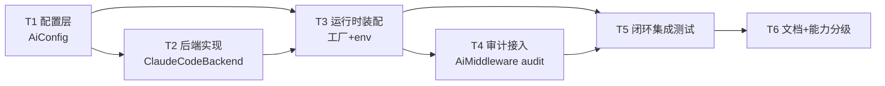

# Step 3:任务拆分计划 — ClaudeCodeBackend

> 关联:[设计](claude-code-backend-design.md) · [四角挑战](claude-code-backend-challenge.md)
> 主闭环(唯一):`微信入站 text → Pipeline.AI(claude_code)→ spawn claude -p → Formatter → Outbox.pending → Worker → ilink send → sent`
> 每个任务独立可验收;依赖明确;标注涉及的迁移红线。

---

## 任务依赖图

---

## T1 · 配置层:`AiConfig` / `ClaudeCodeConfig`
- **改动**:`src/infrastructure/config.rs` 新增 `AiConfig`、`ClaudeCodeConfig`(均 `#[serde(default)]`);`AppConfig` 增 `pub ai: AiConfig`,默认 `backend="echo"`。
- **红线**:0.5 模型变更同步(仅配置,不涉 schema/recovery);最小开放面(默认 echo)。
- **验收 DoD**:
  - 旧配置 JSON(无 `ai` 字段)反序列化成功且 `backend=="echo"`(单测)。
  - `ClaudeCodeConfig` 默认值:`binary_path="claude"`、`timeout_secs=60`、`max_output_bytes=16384`、`extra_args=["--permission-mode","plan"]`。
  - `cargo test` + clippy 通过。
- **依赖**:无。

## T2 · 后端实现:`ClaudeCodeBackend`
- **改动**:新文件 `src/core/ai/claude_code.rs`,`mod.rs` 加 `pub mod claude_code;`。实现 `AiBackend`:
  - `tokio::process::Command::new(binary).arg("-p").arg(prompt).args(extra_args)` + `--output-format json`,**显式 argv,绝不 shell**;`kill_on_drop(true)`。
  - `tokio::time::timeout(timeout_secs)` 包裹;超时 `start_kill()` + await 回收 → `Err`。
  - stdout/stderr **分离**捕获,各设 `max_output_bytes` 上限并截断;stderr 仅日志。
  - 解析 stdout JSON 取 `.result`;`.is_error==true` 或非零退出 → `Err`;JSON 解析失败回退纯文本。
  - 输出消毒:长度上限 + 去控制字符。
- **红线**:2.5(由外层 `ResilientAiBackend` 覆盖熔断/隔离,本任务不重复实现);安全(命令注入防护、受限 plan 模式、子进程回收)。
- **验收 DoD**(单测,用桩 `claude` 脚本,hermetic 不联网):
  - 正常:桩回显固定文本 → `generate` 返回该文本。
  - 安全:prompt 含 `` $(rm -rf /) `` → 桩回显 argv 证明作为纯文本参数、无展开。
  - 超时:桩 sleep 超时 → `Err`,子进程被 kill(无残留)。
  - 截断:桩输出超 `max_output_bytes` → 截断标记。
  - 二进制缺失:`binary_path` 不存在 → `Err`。
- **依赖**:T1。

## T3 · 运行时装配:工厂 + 环境变量
- **改动**:
  - `src/infrastructure/runtime.rs`(~119 行):`match config.ai.backend { "claude_code" => ClaudeCodeBackend::new(...), _ => EchoBackend }`,再包 `ResilientAiBackend`。
  - `src/main.rs::load_runtime_config`:`MAGICLAW_AI_BACKEND` 环境变量覆盖 `config.ai.backend`(与 `MAGICLAW_API_TOKEN` 同模式)。
- **红线**:0.2 运行时装配(接入唯一组合根,不留"已实现无调用方");回滚安全(默认 echo)。
- **验收 DoD**:
  - 默认/未知值 → echo(单测 factory)。
  - `MAGICLAW_AI_BACKEND=claude_code` → 装配 claude_code(单测)。
  - `cargo test` + clippy + `cargo build --release` 通过。
- **依赖**:T1、T2。

## T4 · 审计接入:AI 调用留痕
- **改动**:`AiMiddleware` 增 `Option<Arc<dyn AuditSink>>`;`generate` 后写一条 `audit_log`(source、RouteKey、backend、result/err 摘要、时间)。runtime 装配时注入现有 `SqliteAuditSink`。后端保持纯净(审计在中间件层,不进 `core/ai`)。
- **红线**:2.6 审计与可追溯(关键发送决策留痕)。
- **验收 DoD**:
  - 一次 AI 调用后 `audit_log` 新增一行,含 backend 名与结果(单测/集成)。
  - echo 路径同样留痕(不回归)。
- **依赖**:T3。

## T5 · 闭环集成测试(合并 Gate)
- **改动**:`tests/claude_code_backend_closed_loop.rs`。临时 PATH 注入桩 `claude` 脚本(确定性回复,不联网);`MAGICLAW_AI_BACKEND=claude_code`。
- **红线**:0.3 验收与测试(主闭环系统级测试作为 Gate)。
- **验收 DoD**:
  - **主闭环**:投喂一条入站 text → 断言 outbox 投递内容 = 桩回复(非 `[echo]`)。
  - 失败降级:桩缺失 → pipeline 仍产出回复、无 panic、走降级分支。
  - 审计:断言该消息在 `audit_log` 有 AI 记录(衔接 T4)。
  - 全量 `cargo test` 绿;覆盖率维持红线(AI 路径)。
- **依赖**:T3、T4。

## T6 · 文档 + 能力分级
- **改动**:更新部署/使用说明(如何启用 `MAGICLAW_AI_BACKEND=claude_code`、成本/延迟/隐私须知);在 PR 标注本能力为 `closed`(满足主链路接入 + 闭环测试 + 红线)。
- **红线**:0.4 能力分级(仅 `closed` 计入完成度)。
- **验收 DoD**:文档落地;PR checklist 勾选;旧模块接入检查表(§设计 6)逐项确认。
- **依赖**:T5。

---

## 阶段完成判定(Step 7 预期)
- 主闭环测试 T5 通过 = 阶段完成核心依据;单测仅为局部证明。
- 仅当 T1–T6 全绿且四角挑战无遗留 Blocking,本能力标记 `closed`;否则 `experimental`。
- 根因回退映射:闭环失败→T5/T3;后端逻辑 bug→T2;装配遗漏→T3;红线违规→复查设计 §5/§8。
