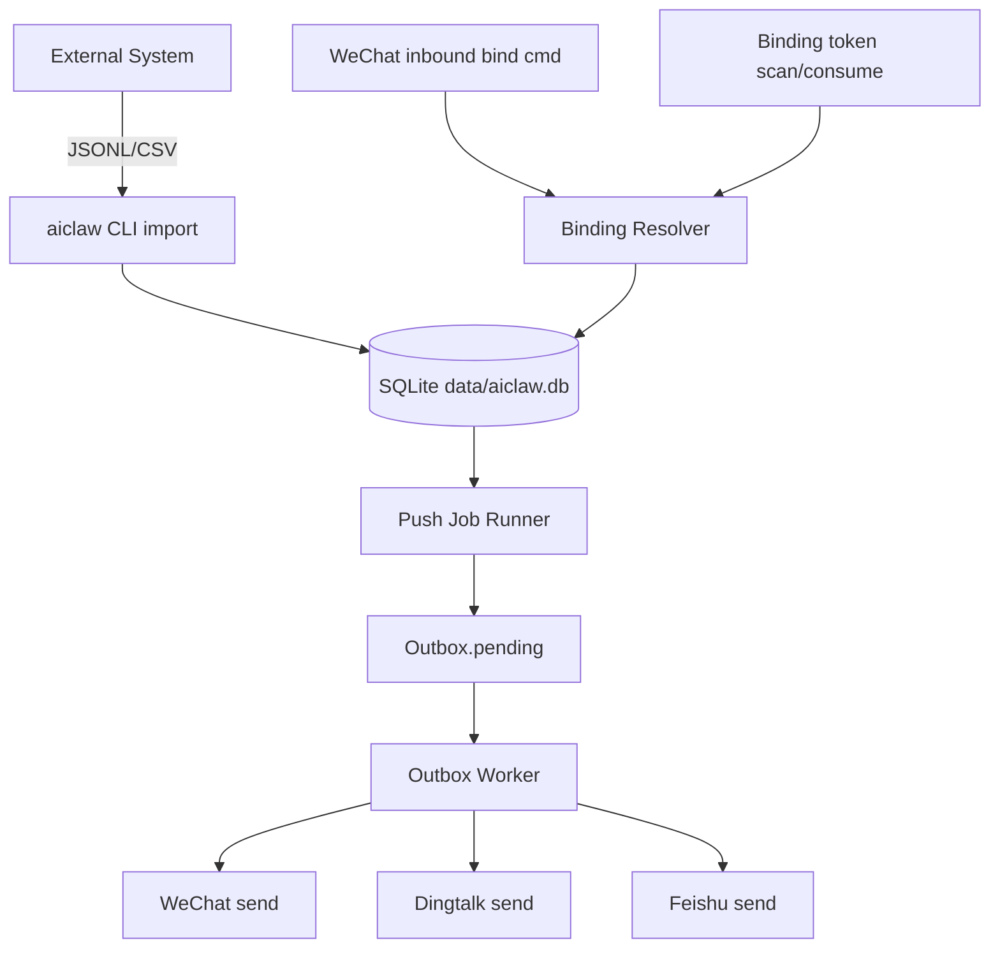

# 项目绑定与多人推送设计（外部项目 + 本地导入）

> 日期：2026-06-19  
> 状态：design（待评审）  
> 能力分级目标：Phase-1 `experimental`，闭环验证后升 `closed`

---

## 1. 背景与目标

当前系统已具备：

- WeChat 入站/出站主链路
- SQLite Inbox/Outbox/DLQ + 崩溃恢复
- MCP/CLI/daemon 运行模式
- AI 可插拔与限流

但缺少以下业务能力：

1. 项目与平台目标端点绑定（多对多）
2. 支持“扫码登录后命令绑定”与“绑定码/链接自动绑定”两种入口
3. 支持项目维度的多人广播与项目内定向推送
4. 外部系统先通过 CLI/文件导入（JSONL + CSV）对接
5. 数据统一收拢到 `data/` 目录下
6. 同一项目消息可同时扇出到不同平台（wechat / dingtalk / feishu）

本设计目标是在不破坏现有核心投递链路的前提下，增加“项目绑定中心 + 推送任务导入中心”。

---

## 2. 范围与非目标

### 2.1 本期范围

- 在现有 `data/aiclaw.db` 增加绑定与推送相关表
- 新增 CLI 命令：导入绑定、导入推送、执行推送、查看绑定
- 支持两种绑定入口：
  - 扫码后在微信发送绑定命令
  - 使用绑定码/链接自动绑定
- 支持两种推送模式：
  - 项目全员广播
  - 项目内定向用户集合
- 广播/定向均支持跨平台扇出（按绑定目标的 `channel` 分组路由）
- 导入格式支持 JSONL + CSV

### 2.2 非目标（本期不做）

- 不做完整后台管理 UI
- 不做外部项目主数据托管（项目仍来自外部系统）
- 不做新中间件或分布式队列依赖
- 不改现有 MCP `send/list_peers/login` 的协议语义

---

## 3. 方案比较与选型

### 方案 A：纯文件映射

- 做法：`data/` 下多个 JSON 文件维护绑定和推送任务
- 优点：实现快
- 缺点：并发一致性差、恢复复杂、审计与重试困难

### 方案 B：SQLite 绑定中心（选中）

- 做法：扩展现有 `aiclaw.db`，绑定和推送任务入库，发送仍走 outbox
- 优点：事务一致性好、与现有恢复/审计模型一致、易扩展到 HTTP/MCP
- 缺点：需要 schema 扩展与 CLI 子命令

### 方案 C：外部消息队列

- 做法：导入任务写外部队列，aiclaw 消费
- 优点：吞吐更高
- 缺点：复杂度高，不适合当前阶段

**结论：选方案 B。**

---

## 4. 总体架构与数据流



关键点：

- 推送任务不直接发送，统一落 outbox，保持可恢复投递语义
- 绑定关系与 token 消费落库并审计
- 失败重试、死信仍复用现有 outbox/dlq 能力

---

## 5. 数据模型设计（SQLite）

在现有数据库新增表：

### 5.1 `projects`

- `project_key TEXT PRIMARY KEY`
- `project_name TEXT NOT NULL`
- `source_system TEXT`（外部系统标识）
- `metadata_json TEXT`（扩展字段）
- `created_at INTEGER NOT NULL`
- `updated_at INTEGER NOT NULL`

### 5.2 `delivery_targets`（跨平台目标端点）

- `target_id TEXT PRIMARY KEY`
- `channel TEXT NOT NULL`（`wechat` / `dingtalk` / `feishu`）
- `peer_id TEXT NOT NULL`
- `conversation_id TEXT NOT NULL`
- `conversation_type TEXT NOT NULL`（`direct` / `group` / `thread` / `bot_session`）
- `account_scope TEXT`（可选：账号/租户隔离键）
- `last_seen_at INTEGER`
- `status TEXT NOT NULL DEFAULT 'active'`
- `created_at INTEGER NOT NULL`
- `updated_at INTEGER NOT NULL`
- UNIQUE(`channel`, `peer_id`, `conversation_id`, `conversation_type`, `account_scope`)

### 5.3 `project_bindings`（多对多核心）

- `id TEXT PRIMARY KEY`
- `project_key TEXT NOT NULL`
- `target_id TEXT NOT NULL`
- `bind_source TEXT NOT NULL`（`wechat_command` / `token_scan` / `import`）
- `status TEXT NOT NULL DEFAULT 'active'`（`active` / `revoked`）
- `bound_at INTEGER NOT NULL`
- `unbound_at INTEGER`
- `created_at INTEGER NOT NULL`
- `updated_at INTEGER NOT NULL`
- UNIQUE(`project_key`, `target_id`)

### 5.4 `binding_tokens`

- `token TEXT PRIMARY KEY`
- `project_key TEXT NOT NULL`
- `target_channel TEXT`（可选，指定平台）
- `target_peer_id TEXT`（可选，指定用户）
- `expires_at INTEGER NOT NULL`
- `consumed_at INTEGER`
- `consumed_by_target_id TEXT`
- `status TEXT NOT NULL DEFAULT 'active'`（`active` / `consumed` / `expired` / `revoked`）
- `created_at INTEGER NOT NULL`
- `updated_at INTEGER NOT NULL`

### 5.5 `push_jobs`

- `job_id TEXT PRIMARY KEY`
- `source_format TEXT NOT NULL`（`jsonl` / `csv`）
- `source_path TEXT NOT NULL`
- `status TEXT NOT NULL`（`pending` / `running` / `done` / `failed` / `partial`）
- `total_items INTEGER NOT NULL DEFAULT 0`
- `success_items INTEGER NOT NULL DEFAULT 0`
- `failed_items INTEGER NOT NULL DEFAULT 0`
- `created_at INTEGER NOT NULL`
- `updated_at INTEGER NOT NULL`

### 5.6 `push_job_items`

- `item_id TEXT PRIMARY KEY`
- `job_id TEXT NOT NULL`
- `project_key TEXT NOT NULL`
- `message_text TEXT NOT NULL`
- `mode TEXT NOT NULL`（`broadcast` / `targeted`）
- `target_targets_json TEXT`（定向目标数组：元素包含 `channel+peer_id+conversation_id+conversation_type`）
- `status TEXT NOT NULL`（`pending` / `queued` / `failed`）
- `error TEXT`
- `created_at INTEGER NOT NULL`
- `updated_at INTEGER NOT NULL`

索引建议：

- `project_bindings(project_key, status)`
- `project_bindings(target_id, status)`
- `binding_tokens(project_key, status, expires_at)`
- `push_job_items(job_id, status)`
- `delivery_targets(channel, status)`

---

## 6. 绑定流程设计

### 6.0 扫码登录（绑定前置，平台相关）

绑定的前提是目标平台已完成登录/会话建立。登录是**平台相关**能力，不是跨平台统一前提：

- **WeChat（本期设计）**：复用 ilink 已有底层能力闭环登录。
  1. 调用 `get_bot_qrcode`（bot_type=3）获取登录二维码
  2. 展示二维码（CLI 输出二维码内容/图片字段，或写入 `data/login/` 供外部渲染）
  3. 轮询 `get_qrcode_status` 直到扫码确认
  4. 登录就绪后进入 long-poll，sync_buf 持久化，账号会话可恢复
  5. 写 `audit_log`（action=`wechat_login`）
- **Dingtalk / Feishu（后续平台各自方案）**：使用各自平台的鉴权/授权流程，不走 ilink 二维码；本设计仅占位，不在本期实现。

现状说明（诚实披露）：

- `get_bot_qrcode` / `get_qrcode_status` 底层函数**已存在**于 ilink 层，但尚未串成 runtime/CLI 登录闭环。
- 因此“扫码登录”作为可交付能力属于本期**新增实现项**，需要一条专门的 CLI/命令把上述步骤接起来（见 §13 Phase B）。

### 6.1 扫码后命令绑定

1. 前置：用户已完成 §6.0 扫码登录，且该用户对机器人发过消息，已有有效 context_token
2. 用户在微信发送命令：`绑定项目 <project_key>` 或 `bind <project_key>`
3. 系统解析命令并校验项目存在
4. 写入 `delivery_targets` + `project_bindings`
5. 写 `audit_log`（action=`project_bind`）

失败处理：

- 项目不存在：返回错误提示，不写绑定
- 已绑定：返回幂等成功提示

### 6.2 绑定码/链接自动绑定

1. 外部系统生成 token（导入或命令生成）
2. 用户扫码进入绑定动作，携带 token
3. 系统校验 token 状态与过期时间
4. 消费 token，写绑定关系
5. 更新 token 状态为 `consumed`
6. 写审计日志

失败处理：

- 过期/已消费/撤销 token：拒绝并记录审计

落地入口说明（重要）：

- 第 2 步“用户扫码后命中 aiclaw”需要一个**用户侧入口**：要么 HTTP 落地页消费 token，要么入站消息携带 token（如 `bind-token <token>`）。
- 本期 Phase A 只有 CLI，**没有该落地入口**，因此“绑定码自动绑定”在 Phase A **不交付**，排到 Phase B 并明确入口形态。
- Phase A 仅交付：schema、文件导入绑定（§8）、推送导入与 `push run`；命令绑定（§6.1）依赖扫码登录（§6.0），随 Phase B 交付。

---

## 7. 推送流程设计

### 7.0 WeChat 主动推送前置约束（平台特性）

WeChat ilink 是**被动信道**：要主动给某个 peer 推送，必须持有该 peer 的有效 `context_token`，而 token 只能来自该用户**最近一次入站消息**（运行时通过 long-poll 抓取并缓存）。

影响与处理：

- 对**从未给机器人发过消息**或会话窗口已失效的 WeChat 目标，主动推送会失败。
- 此类目标在推送时计为 `skipped`（区别于真实发送失败），并在 `push_job_items.error` 标注“需用户先发消息激活会话窗口”。
- Dingtalk / Feishu 不受此约束（按各自平台主动推送能力实现）。

### 7.1 广播模式

1. 从 `project_bindings` + `delivery_targets` 查询项目下 `active` 目标端点
2. 按 `channel` 分组，为每个目标端点生成一条 outbox 投递请求
3. 更新 `push_job_items.status=queued`
4. worker 异步发送并按现有状态机推进

### 7.2 定向模式

1. 读取 `target_targets_json`
2. 校验目标是否属于项目活跃绑定集合
3. 合法目标写 outbox；非法目标计失败
4. 作业最终状态根据成功/失败计数汇总

### 7.3 语义保证

- 广播/定向只是“批量写 outbox”策略层，不绕过 outbox
- 返回值区分“已入队”和“已送达”

---

## 8. CLI 设计

### 8.1 命令清单（第一阶段）

- `aiclaw bind import --jsonl <path>`
- `aiclaw bind import --csv <path>`
- `aiclaw push import --jsonl <path>`
- `aiclaw push import --csv <path>`
- `aiclaw push run --job <job_id>`
- `aiclaw project list`
- `aiclaw binding list --project <project_key>`

### 8.2 导入格式

#### JSONL（推送）

每行示例：

```json
{"project_key":"proj_a","mode":"broadcast","message_text":"今日日报提醒"}
{"project_key":"proj_a","mode":"targeted","target_targets":[{"channel":"wechat","peer_id":"u1","conversation_id":"conv_u1","conversation_type":"direct"},{"channel":"dingtalk","peer_id":"dt_u2","conversation_id":"dt_conv_2","conversation_type":"direct"}],"message_text":"仅核心成员"}
```

#### CSV（推送）

列示例：

```text
project_key,mode,target_targets,message_text
proj_a,broadcast,,今日日报提醒
proj_a,targeted,"wechat:u1:conv_u1:direct|dingtalk:dt_u2:dt_conv_2:direct",仅核心成员
```

#### JSONL（绑定）

```json
{"project_key":"proj_a","channel":"wechat","peer_id":"u1","conversation_id":"conv_u1","conversation_type":"direct","bind_source":"import"}
```

#### CSV（绑定）

```text
project_key,channel,peer_id,conversation_id,conversation_type,bind_source
proj_a,wechat,u1,conv_u1,direct,import
```

---

## 9. 存储路径收拢

### 9.1 已收拢

- 默认数据库路径：`data/aiclaw.db`

### 9.2 本设计新增

- 导入文件建议目录：`data/import/`
- 导出报表建议目录：`data/export/`
- WeChat 数据目录后续收拢目标：`data/wechat/`
  - 兼容顺序建议：`WECHAT_CHANNEL_DIR` > `data/wechat` > 旧路径

---

## 10. 失败模式与恢复

1. 导入文件格式错误：
   - 逐条校验失败写 `push_job_items.error`
   - 作业状态允许 `partial`

2. 并发绑定竞争：
   - 用 `UNIQUE(project_key, target_id)` + UPSERT 保幂等

3. token 重放：
   - 原子更新 `binding_tokens.status`，确保一次性消费

4. 推送中断：
   - 已入队数据由 outbox 恢复机制继续处理

5. 下游发送失败：
   - 按现有 retry + dead_letter 机制兜底

6. 跨平台部分失败：
   - 同一 job item 允许 `partial`；失败平台记录到 `push_job_items.error` 细分字段

---

## 11. 审计与安全

新增审计动作：

- `project_bind`
- `project_unbind`
- `binding_token_create`
- `binding_token_consume`
- `push_job_import`
- `push_job_run`

安全要求：

- token 必须有过期时间
- token 消费必须幂等且防重放
- 外部导入文件路径需白名单或规范目录，避免任意路径读

---

## 12. 测试策略

### 12.1 单元测试

- CSV/JSONL 解析
- 绑定 upsert 幂等
- token 消费状态机
- 广播/定向跨平台目标解析与校验

### 12.2 集成测试（闭环）

- 导入推送任务 -> run -> outbox 生成条数正确
- 项目广播覆盖全部绑定目标（可跨平台）
- 项目定向只覆盖指定子集目标（可跨平台）
- 非法目标不会入队并记录错误
- 崩溃恢复后继续发送未完成 outbox

---

## 13. 分阶段实施建议

### Phase A（最小闭环）

- schema 扩展
- 绑定导入（JSONL/CSV）
- 推送导入（JSONL/CSV）
- `push run` 广播/定向写 outbox

### Phase B（绑定入口增强）

- 扫码登录闭环（get_bot_qrcode → get_qrcode_status → long-poll 就绪），见 §6.0
- 绑定码自动绑定的落地入口（HTTP 落地页或入站 `bind-token` 命令）+ token 消费
- 微信命令绑定解析（§6.1）如未在 A 完成则在此补齐

### Phase C（运维与可观测）

- 任务状态查询
- 统计报表导出
- 告警与审计视图

---

## 14. 开放问题（待确认）

1. 绑定命令关键字最终规范（中文/英文是否并存）
2. token 过期默认值（建议 24h）
3. 定向目标字段在 CSV 的分隔符规范（建议 `|`，元素格式建议 `channel:peer_id:conversation_id:conversation_type`）
4. 外部系统 project_key 命名规则（大小写/长度）
5. 多平台账号隔离键 `account_scope` 的来源与规范

---

## 15. 结论

采用“SQLite 绑定中心 + CLI 文件导入 + 复用 outbox 投递”的方案，在当前架构风险最小、闭环最稳，能够满足：

- 项目-目标端点（跨平台）多对多绑定
- 扫码后命令绑定 + 绑定码自动绑定
- 项目广播 + 项目内定向推送（支持跨平台）
- JSONL + CSV 双格式导入
- 数据统一收拢到 `data/` 目录
