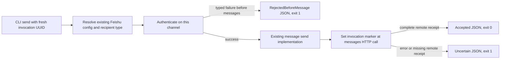

# Feishu text CLI delivery evidence v1

Status: experimental isolated candidate. This document records an agent review; it is not human approval or a deployment receipt.

## Problem and one closed loop

The legacy Feishu CLI returns a success receipt line or an unstructured nonzero exit. A caller cannot safely distinguish an authentication failure before the messages request from a failure after that request. The change adds one opt-in loop:

The call site is `main::run_send_feishu`, reached by `main -> run_send_command -> run_send_feishu`. Opt-in execution calls `FeishuChannel::send_text_with_delivery_evidence`. Its first `ensure_tenant_token` failure produces the dedicated `AuthBeforeMessage` value. That opt-in auth HTTP client disables redirects, so an auth redirect cannot cross into the messages endpoint; the legacy client policy remains unchanged. After authentication it uses the same private implementation as `Channel::send_message`, which sets a local marker immediately before the messages HTTP `send` call. A later authentication failure, local failure, message error, missing remote ID, panic, kill, or incomplete stdout cannot inherit the first-auth rejection evidence.

No production mock, fault injection, retry, resend, recovery worker, database, durable history rewrite, or actual Feishu network test is added. The fixture uses a loopback HTTP server and synthetic credentials.

## Protocol and trust boundary

Flags: `send --channel feishu --delivery-result-json-v1 --invocation-id <canonical lowercase UUIDv4>` plus the existing `--message`, `--to`, and optional `--receive-id-type`. The consumer generates a new random UUIDv4 for each real spawn; durable decision/attempt IDs must not be used as the nonce. Both new flags are required together and are unavailable to non-Feishu sends.

Stdout is exactly one complete JSON object followed by newline. Logs remain on stderr. Fields are fixed:

|Field|Meaning|
|---|---|
|schema|`magiclaw.feishu_delivery.v1`|
|invocation_id|Exact caller nonce|
|channel|`feishu`|
|account_id|Actually resolved configured account ID|
|app_id_sha256|Lowercase SHA-256 of resolved configured app ID UTF-8 bytes|
|receive_id_type|Actual resolved ID type; explicit flag still takes precedence|
|target_sha256|Lowercase SHA-256 of the actual trimmed recipient UTF-8 bytes|
|content_sha256|Lowercase SHA-256 of exact original message UTF-8 bytes, including whitespace|
|kind, phase, message_request_started, reason_code|Closed combinations below|
|receipt|Only present for Accepted; `message_id` is a canonical lowercase RFC4122 UUIDv4 and `platform_message_id` is `om_` plus 1..128 lowercase ASCII letters/digits|

|kind|phase|message_request_started|reason_code|receipt|exit|
|---|---|---|---|---|---|
|Accepted|message|true|accepted|Required, both IDs|0|
|RejectedBeforeMessage|auth|false|feishu_auth_failed_before_message|Absent, not null|1|
|Uncertain|message|true|feishu_message_result_unconfirmed|Absent|1|
|Uncertain|preflight|false|feishu_preflight_unconfirmed|Absent|1|

Authentication transport, response parsing, and token exchange errors all originate inside the first-auth boundary. Their raw text is never inspected to infer phase and never copied into JSON. A provider business rejection after the messages call remains Uncertain in this narrow change. Missing recipient/invalid CLI syntax may exit without JSON; that supplies no rejection authority.

Configured app/account metadata is not an independent GET of provider identity. The stock consumer opt-in requires an expected application SHA-256 and expected account ID, sourced from nonsecret approved configuration, and verifies the returned configured values. It passes an explicit receive ID type selected by the existing process configuration or established recipient-prefix rule and verifies the echoed actual value. It independently computes target/body hashes, validates fresh nonce, the complete variant, exit status, unknown/duplicate keys, size and trailing-output limits. Parsing is not a fallback send or a new retry owner. Existing durable TypedRejection/Uncertain finalization and the spawn-before-attempt marker remain in the consumer.

The protocol assumes a reviewed producer binary paired with a reviewed consumer binary; schema and nonce alone do not prove an arbitrary replacement executable is trustworthy. Candidate/deployment binary hashes must be recorded. A killed process may produce no complete JSON even after a send. That is Uncertain, and neither side automatically spawns a second send. Provider Accepted does not prove the user's client displayed the message. This v1 supplies evidence for future fresh invocations only; it cannot adjudicate or replay the existing 79 uncertain records.

JSON contains no token, secret, raw recipient, message body, provider error text, or remote-fact timestamp. The existing local UUID alone is insufficient for Accepted: the remote platform ID is mandatory. The bounded remote grammar accepts natural IDs containing `x`; a fixed length or hexadecimal-only assumption is not made. Missing, malformed or placeholder IDs remain Uncertain after the messages marker.

## Existing modules and applicable rules

|Existing surface|Decision|
|---|---|
|Legacy Feishu CLI|Uses the same send implementation and retains its exact existing stdout line and error behavior|
|Feishu Channel trait / daemon / media|Trait signature and existing errors remain unchanged; shared implementation receives no observation marker on these routes|
|WeChat, DingTalk, MCP, REST, workers|No opt-in route or semantic change|
|RouteKey / Message / OutboxEntry|No model change|
|SQLite schema / replay / DLQ / immutable audit|No schema or state transition change; no old-row mutation|
|Stock durable consumer|Separate isolated change; enforces fresh binding and converts only the exact auth-before-message variant|

AGENTS.md requires design, role challenge, plan, independent review, tests, coverage, integration and isolation/crash evidence before an integration claim. Its migration-platform requirements remain applicable to existing platform behavior, but this repair neither migrates RouteKey nor rebuilds the worker/outbox/agent platform. The existing direct CLI route bypasses the magiclaw daemon/outbox; that existing boundary is preserved. New protocol capability remains experimental until producer/consumer fixture alignment and independent review complete. Coverage thresholds must be measured for the affected new logic; unmeasured whole-platform coverage is not reported as passing.

## Failure and rollback

Auth-before-message -> a complete bound rejection, no messages request. Message started -> no definitive pre-message claim. JSON write failure / panic / kill -> incomplete evidence, consumer Uncertain. Invalid opt-in on a legacy executable -> no trusted v1 result, consumer Uncertain, no automatic fallback. Config/recipient type disagreement -> consumer Uncertain and configuration review, preserving the existing identity.

Rollback disables consumer opt-in and restores the recorded executable pair through the existing deployment process. This candidate does not perform that process or alter production binary/env. Legacy behavior is available without new flags.
