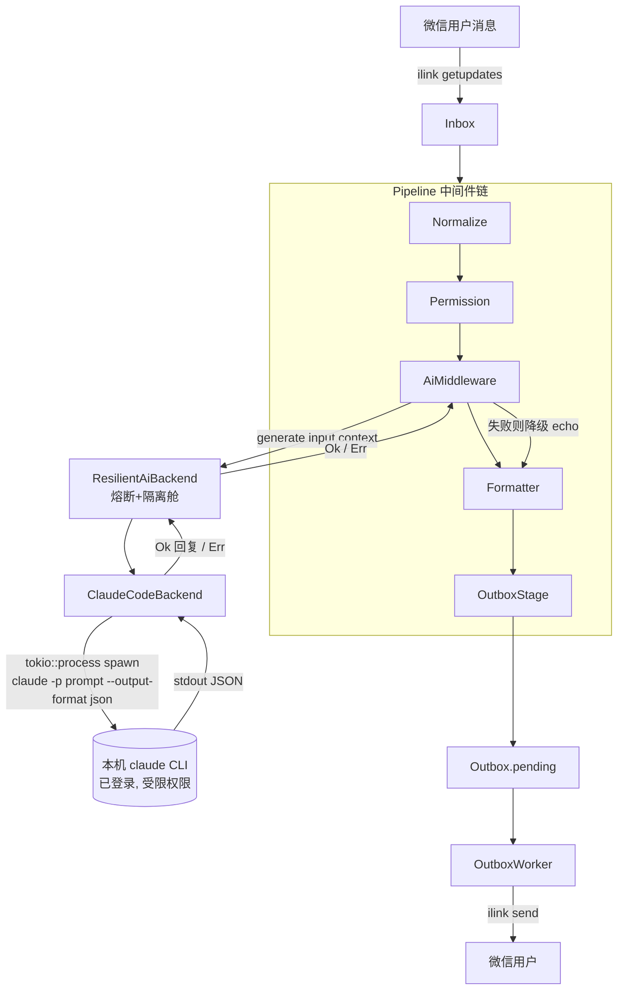

# 设计文档:ClaudeCodeBackend(调用本机 Claude Code CLI 作为 AI 后端)

> 流程阶段:AGENTS 七步门控 · **Step 1(架构设计)**
> 关联红线:`RUST_MIGRATION_V5` 2.5 韧性与隔离、Phase 4「AI backend 可切换并可降级到 echo」
> 能力分级目标:`closed`(接入主链路 + 闭环测试 + 满足当前阶段红线)
> **实现状态(Step 4–7)**:已实现并接入运行时主链路;`cargo test` 全绿(lib 126 + 集成,新增 claude_code 单测 7、闭环集成 2);clippy 无新增告警;运行时实测启用日志 `AI backend: claude_code (local claude CLI, restricted)` + stdout 零污染。能力分级:**`closed`**。
> 安全等级:**高**——把不可信的微信文本喂给具备本机执行能力的 agent,必须按受限调用处理。

---

## 1. 目标与非目标

### 1.1 目标
- 新增一个**真实**的 `AiBackend` 实现 `ClaudeCodeBackend`,在收到微信文本消息时,以**非交互(headless)模式**拉起本机已登录的 `claude` CLI(Claude Code),把用户消息作为 prompt,取其输出作为回复,经现有 Outbox 链路投递回微信。
- 后端**可通过配置/环境变量切换**,默认仍为 `echo`,任何失败都**降级到 echo**(不阻断主链路)。
- 复用现有 `ResilientAiBackend`(熔断 + 隔离舱),满足红线 2.5。

### 1.2 非目标
- 不实现"调用桌面版 Claude"——桌面应用无对外可调用的本地 API,方向相反(它是 MCP host)。本设计只覆盖 **CLI spawn** 路径。
- 不改动 `ClaudeBackend`(`claude.rs`,基于 Anthropic API 的 stub)与 `OpenAiBackend`,二者与本后端是**并列**关系,本期不动。
- 不引入多轮会话记忆/工具调用编排(后续可作为独立阶段)。

---

## 2. 数据流图



**关键点**:`AiMiddleware` 已实现"失败降级 echo"(见 `src/core/pipeline/ai.rs` 的 `Err` 分支),因此 `ClaudeCodeBackend` 只需在异常时返回 `Err`,主链路即自动降级,不会中断投递。

---

## 3. 接口与装配(贴合现有代码)

### 3.1 新增后端
- 新文件 `src/core/ai/claude_code.rs`,实现 `AiBackend`:
  - `fn name(&self) -> &'static str { "claude_code" }`
  - `async fn generate(&self, input, context) -> Result<String, String>`:用 `tokio::process::Command` spawn `claude`,**显式 argv**(绝不经过 shell),读取 stdout,解析输出,成功返回文本,任何异常返回 `Err`(交由中间件降级)。
- `src/core/ai/mod.rs` 增加 `pub mod claude_code;`。

**已核验调用形态(本机 `claude` v2.1.170,`/usr/local/bin/claude`)**:
```
claude -p "<prompt>" --output-format json --permission-mode plan
```
- `-p/--print`:headless 非交互模式;`--output-format json`:结构化输出。
- `--permission-mode plan`:**只读规划模式**,不改文件、不执行命令——作为受限执行的首选。
- 输出 JSON 结构(已实测):`{"type":"result","subtype":"success","is_error":false,...,"result":"<回复文本>","stop_reason":"end_turn",...}`。回复取 `.result`,错误判定看 `.is_error == true` 或非零退出。
- **成本/延迟实测**:单次约 `$0.14`、延迟 `~3.3s`(本机 `claude` 实际路由到 `deepseek-v4` 模型,非 Anthropic;模型由本机 claude 配置决定)。→ 需在 Step 2 评审「每条微信消息触发一次付费 + 数秒延迟」是否可接受,可能需加节流/开关。

### 3.2 配置(可切换 + 可回滚)
- `src/infrastructure/config.rs` 新增 `AiConfig`(`#[serde(default)]`,默认 `echo`):
  ```text
  AiConfig {
      backend: String,                 // "echo" | "claude_code",默认 "echo"
      claude_code: ClaudeCodeConfig {
          binary_path: String,         // 默认 "claude"
          timeout_secs: u64,           // 默认 60,超时杀子进程
          max_output_bytes: usize,     // 默认 16384,超量截断
          working_dir: Option<String>, // 默认临时只读沙箱目录
          extra_args: Vec<String>,     // 受限权限相关参数(见 §5)
      }
  }
  ```
  `AppConfig` 增加 `pub ai: AiConfig`(serde default,旧配置零改动可加载)。
- `src/main.rs::load_runtime_config` 增加环境变量覆盖 `AICLAW_AI_BACKEND`(与现有 `AICLAW_API_TOKEN` 写法一致),便于快速切换/回滚。

### 3.3 运行时装配(唯一接线变更)
- `src/infrastructure/runtime.rs` 第 119–120 行,把写死的 `EchoBackend` 改为**工厂选择**:
  ```text
  let inner: Arc<dyn AiBackend> = match config.ai.backend.as_str() {
      "claude_code" => Arc::new(ClaudeCodeBackend::new(config.ai.claude_code.clone())),
      _ => Arc::new(EchoBackend),            // 默认/未知 → echo(回滚安全)
  };
  let ai_backend = Arc::new(ResilientAiBackend::new(inner, ai_gate));  // 熔断/隔离不变
  ```
- `AiMiddleware`、`ResilientAiBackend`、Pipeline 装配其余部分**完全不变**。

---

## 4. 失败模式分析(每个失败源如何处理)

| 失败源 | 触发 | 处理 | 结果 |
|--------|------|------|------|
| `claude` 二进制不存在 / PATH 错 | spawn 报 `NotFound` | 捕获 → `Err("claude binary not found: ...")` | 中间件降级 echo;熔断累计失败 |
| 未登录 / 认证失败 | 子进程非零退出 + stderr | 读 stderr 摘要 → `Err` | 降级 echo;不泄露完整 stderr 到微信 |
| 子进程挂起 / 长耗时 | 超 `timeout_secs` | `tokio::time::timeout` 超时 → 显式 `child.start_kill()` 并 await 回收 → `Err("timeout")` | 降级 echo;释放隔离舱名额;**无僵尸/孤儿进程** |
| 输出过大 | stdout 超 `max_output_bytes` | 读取时截断,标注 `…(truncated)` | 正常返回截断文本 |
| 非 UTF-8 输出 | 二进制/乱码 | `from_utf8_lossy` | 正常返回(有损) |
| 输出 JSON 解析失败 | 格式变化 | 回退到读纯文本 stdout | 正常/或 `Err` 降级 |
| 并发过载 | 同时大量入站 | `ResilienceGate` 隔离舱拒绝 | `Err` → 降级 echo |
| 连续失败 | 失败累计达阈值 | 熔断器 Open,停止 spawn | 直接 `Err` → 降级,保护主机 |
| 模型返回危险/超长内容 | prompt injection 等 | 发送前对输出做长度上限 + 去控制字符 | 投递安全文本 |

**进程与 I/O 硬约束(Step 2 · B1/B2)**:
- `Command::kill_on_drop(true)` 固定开启;超时分支显式 `start_kill()` + await,确保不留僵尸/孤儿进程。
- **stdout/stderr 分离捕获**:回复只从 stdout JSON 的 `.result` 取;stderr 仅入本地日志、不外泄;两路读取均受 `max_output_bytes` 上限,避免管道阻塞挂死 worker。

**核心不变量**:无论哪种失败,主链路都不 panic、不阻塞,始终产出一条可投递回复(成功结果或 echo 降级)。

---

## 5. 安全设计(OWASP / 高风险项)

> 本特性把**不可信外部输入(微信任意文本)**交给一个**具备本机文件/命令执行能力的 agent**。这是最大风险面,必须显式收敛。

1. **杜绝命令注入(A03)**:使用 `tokio::process::Command::new(binary).arg("-p").arg(prompt)`,prompt 作为**单个 argv 参数**传入,**绝不**拼接进 `sh -c`/shell 字符串,从根本上消除 shell 元字符注入。
2. **限制 agent 权限(防 prompt injection 提权)**:已核验——采用 `--permission-mode plan`(**只读规划模式**,不写文件/不执行命令)作为受限执行基线;`--allowedTools` 不接受空值,故不依赖它做禁用。额外在受限沙箱 `working_dir`(临时只读目录)中运行,避免 agent 读取真实项目/敏感文件。`extra_args` 默认即 `["--permission-mode", "plan"]`。
3. **资源上限**:强制 `timeout_secs` 杀进程、`max_output_bytes` 截断、隔离舱限制并发、熔断器阻断连续失败,防止 DoS/资源耗尽。
4. **输出消毒**:模型输出在进入 Outbox 前做长度上限 + 去除控制字符,作为不可信文本对待。
5. **不泄露内部信息**:stderr/异常详情只进本地日志(stderr/file),**不**原样发回微信;给用户的降级文案不含主机路径/堆栈。
6. **默认关闭**:默认 `backend=echo`,需显式配置/置环境变量才启用,符合"最小开放面"。
7. **审计留痕(红线 2.6 · Step 2 · D1)**:每次 AI 调用结果(成功/失败/降级)写入 `audit_log`,字段含来源、时间、RouteKey、backend 名、结果或错误摘要;复用现有 `SqliteAuditSink`,不可篡改、保留期符合红线。
8. **数据出境知情(Step 2 · C1)**:微信消息正文会离开本机交给本机 `claude` 配置的模型(实测上行 deepseek 云端)。仅授权(白名单)联系人触发,文档显式披露此数据流向。

> ⚠️ Step 2 四角挑战(尤其"网络通信资深技术研发 + 系统 DDD 架构")必须重点评审第 2 点的受限模式是否充分;若无法证明 agent 执行面被有效收敛,本特性**不得**进入 `closed`。

---

## 6. 与旧模块的关系(旧模块接入检查表 · Step 5 预填)

| 旧模块 | 是否升级接入 | 说明 |
|--------|--------------|------|
| `EchoBackend`(`echo.rs`) | 保留 | 仍作默认后端 + 失败降级目标,不删除 |
| `ClaudeBackend`(`claude.rs`,API stub) | 不接入 | 与本后端并列(API vs CLI),本期不动;保持 stub |
| `OpenAiBackend`(`openai.rs`,stub) | 不接入 | 同上,无关 |
| `ResilientAiBackend`(`resilient.rs`) | 复用 | 包裹新后端,熔断/隔离舱自动覆盖,无需改动 |
| `AiMiddleware`(`pipeline/ai.rs`) | 复用 | 已含 `Err` 降级逻辑,**零改动** |
| `SqliteAuditSink`(audit) | 复用接入 | AI 调用结果写 `audit_log`(红线 2.6);沿现有 audit 端口 |
| `Permission`(`pipeline/permission.rs`,白名单) | 复用 | 作为触发门控:非白名单 peer 不进 AI,控成本+隐私 |
| `RateLimit`(`pipeline/rate_limit.rs`) | 建议接入 | 启用 claude_code 时建议接入做频率/成本上限(独立改动) |
| `core/ai/` 置放约定 | 沿用先例 | spawn 进程虽属 I/O,但 `openai.rs`/`claude.rs` 同类先例已在 `core/ai/`,遵循既有约定 |
| `runtime.rs` 装配 | 改 | 唯一接线点:工厂选择后端 |
| `config.rs` | 改(加 `AiConfig`) | serde default,旧配置兼容 |
| `main.rs::load_runtime_config` | 改(加 env 覆盖) | 与 `AICLAW_API_TOKEN` 同模式 |

确认无"应接入却遗漏"的同类旧模块。

---

## 7. 回滚方案

- **配置回滚(零代码)**:`AICLAW_AI_BACKEND=echo` 或配置 `ai.backend="echo"`,即刻回到当前行为;默认值本就是 echo,误配置/未配置都安全。
- **代码回滚**:改动为**纯增量**(新增 `claude_code.rs` + `AiConfig` + 工厂一行)。`git revert` 工厂接线 + 删除新文件即可;`EchoBackend` 主路径不受影响。
- **无数据迁移**:不涉及 schema、Outbox、recovery、DLQ、audit 字段变更(模型未改),故无"半升级"风险。

---

## 8. 阶段闭环定义与验收(Step 7 预定义)

### 8.1 主闭环(唯一)
```
微信入站 text → Pipeline.AI 调 ClaudeCodeBackend → spawn `claude -p` → 取回复
→ Formatter → Outbox.pending → OutboxWorker → ilink send → sent
```
入口:ilink 入站 → inbox;出口:outbox 行 `sent`。

### 8.2 闭环测试(合并 Gate,系统/集成级)
- **正常闭环**:在 `PATH` 放一个确定性的**桩 `claude` 脚本**(打印固定回复,保持 hermetic、不联网),配置 `backend=claude_code`,投喂一条入站消息,断言 outbox 投递内容为桩脚本回复(而非 `[echo]`)。
  > 桩脚本仅用于测试环境,不进入生产路径,符合「no mock in production path」。
- **失败降级**:`binary_path` 指向不存在的命令,断言 pipeline 仍产出回复、无 panic、ai_response 走降级分支。
- **超时**:桩脚本 sleep 超过 `timeout_secs`,断言子进程被 kill 且返回 `Err` → 降级。
- **安全**:prompt 含 shell 元字符(如 `` $(rm -rf /) ``),断言它作为纯文本参数传递、无命令展开(通过桩脚本回显 argv 验证)。
- 单元测试覆盖 `ClaudeCodeBackend` 解析/截断/超时分支;AI 路径覆盖率维持红线要求。

### 8.3 完成判定
仅当满足:① 已接入 `runtime` 主链路 ② 上述闭环+失败+超时+安全测试通过 ③ Step 2 四角挑战对受限执行面无 Blocking 异议——才标记为 `closed`。否则记为 `experimental`。

---

## 10. 触发策略与成本控制(Step 2 收敛新增)

> 解决四角挑战 A1/A2/C1/C2/D3:成本、延迟体验、隐私、单一职责。

- **默认关闭**:`ai.backend` 默认 `echo`;`claude_code` 为显式 opt-in(配置或 `AICLAW_AI_BACKEND=claude_code`)。
- **触发门控不在后端内**(满足单一职责 D3):由 pipeline 既有中间件承担——
  - **Permission(白名单)**:非白名单 peer 根本不进入 AI 步骤,从源头控成本+隐私。
  - **RateLimit**(建议接入):启用 claude_code 时建议把 `RateLimit` 接入 pipeline,做每会话/全局频率与成本上限(作为独立改动,不阻塞本特性闭环)。
- **成本/延迟预期(如实告知)**:每次实际触发约 `$0.14`、`~3.3s`;same-RouteKey 串行(红线 2.2)下,同一会话连发会**顺序排队、每条数秒**,此为预期行为;跨会话并行,总并发受隔离舱上限约束。
- **token 窗口叠加(B3 备注)**:AI 延迟会占用 ilink token 新鲜度窗口;Outbox 重试兜底;已知 P1 token 刷新问题为独立事项,不在本特性范围。

## 11. 后续步骤
- Step 2:四角挑战已完成并收敛,见 [claude-code-backend-challenge.md](claude-code-backend-challenge.md)(2 轮,无新增 Blocking)。
- Step 3:`/project-planner` 拆分任务。
- 进入编码前的 CLI 能力核验已完成(见 §3.1 已核验调用形态)。
